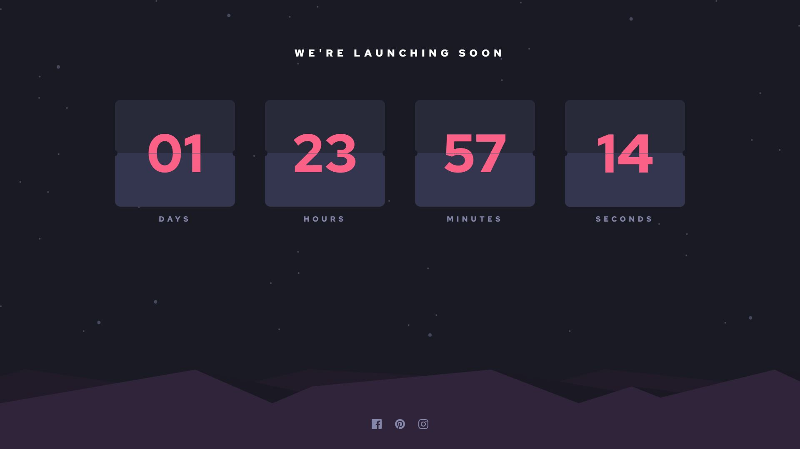

# Launch countdown timer

## Table of contents

- [Overview](#overview)
  - [The challenge](#the-challenge)
  - [Screenshot](#screenshot)
  - [Links](#links)
- [My process](#my-process)
  - [Built with](#built-with)
  - [What I learned](#what-i-learned)
  - [Continued development](#continued-development)
  - [Useful resources](#useful-resources)
- [Author](#author)

## Overview

### The challenge

Users are able to:

- See hover states for all interactive elements on the page
- See a live countdown timer that ticks down every second, starting from 14 days.
- When a number changes, the card animates to reveal the new number.

### Screenshot




### Links

- [Live Site](https://helsel-launch-timer.netlify.app/)

## My process

### Built with

- Semantic HTML5 markup
- [TailwindCSS](https://tailwindcss.com/)
- Vanilla CSS
- Flexbox
- JavaScript

### What I learned

This project was quite challenging. I've been trying to raise my quality standards as I take on these Frontend Mentor challenges so I spent a lot of time polishing this one. This was my first time using the ::before and ::after pseudo elements. I discovered them when watching the video linked in the resources below. It really came in handy for the notches on the sides of the timer sections.

```css
.bottom::before {
    border-radius: 50%;
    background-color: hsl(234, 17%, 12%);

    width: 6%;
    height: 6%;

    position: absolute;
    top: 47%;
    left: -4%;

    content: '';
    z-index: 15;
}

.bottom::after {
    border-radius: 50%;
    background-color: hsl(234, 17%, 12%);

    width: 6%;
    height: 6%;

    position: absolute;
    top: 47%;
    right: -4%;

    content: '';
    z-index: 15;
}
```

Having these hover over the sides of the timers at a high z-index is a fantastic and easy way to make it appear that they're cutouts. Technically it could obscure stars in the background layer but that doesn't seem to be an issue.

The timer was the real challenge of this project and tackling it was very fun. This was my first time using keyframes in CSS instead of just using a transition property. I used a video to get the basic ideas of the implementation down then tweaked it a ton to fit it to this project

The animation aspect is relatively simple. Animations are set up in CSS for extra tiles created at runtime.

```css
.top-flip {
    animation: flip-top 250ms ease-in;
    transform-origin: bottom;
}

@keyframes flip-top {
    100% {
        transform: rotateX(90deg);
    }
}

.bottom-flip {
    animation: flip-bottom 250ms ease-in-out 250ms;
    transform-origin: top;
    transform: rotateX(90deg);
}

@keyframes flip-bottom {
    100% {
        transform: rotateX(0deg);
    }
}
```

```js
//Check if any flipcards need to update
function checkForFlips(time) {
    if(!time <= 0){
        formattedCurrentTime = convertTime(time); //Convert time is a helper function to turn seconds into DD/HH/MM/SS format.
    }
    flipcards.forEach((flipcard, i) => {
        const cardText = parseInt(flipcard.querySelector('.top').textContent);
        if(cardText !== formattedCurrentTime[i])
            flip(flipcard, i === 1 ? 23 : 59);
    })
}

//Handle flip animation and number decrementation for a passed flipcard
function flip(flipCard, max) {
    //Get references to child elements
    const topHalf = flipCard.querySelector(".top");
    const bottomHalf = flipCard.querySelector(".bottom");

    //Create and append elements to animate
    const topFlip = document.createElement("div")
    topFlip.classList.add('top-flip')
    const bottomFlip = document.createElement("div")
    bottomFlip.classList.add('bottom-flip')
    flipCard.append(topFlip, bottomFlip);

    //Get starting and target number
    const startNumber = parseInt(topHalf.textContent);
    const newNumber = startNumber !== 0 ? startNumber - 1 : max;
    //Ensure all elements display the correct text
    bottomHalf.textContent = makeString(startNumber); //makeString() is a helper function to ensure contents are a 2 character string
    topFlip.textContent = makeString(startNumber);
    bottomFlip.textContent = makeString(newNumber);


    topFlip.addEventListener("animationstart", e => {
        topHalf.textContent = makeString(newNumber);
    });
    
    topFlip.addEventListener("animationend", e => {
        topFlip.remove();
    })
    
    bottomFlip.addEventListener("animationend", e => {
        bottomHalf.textContent = makeString(newNumber);
        bottomFlip.remove();
    }); 
}
```


### Continued development

The tablet view of this could definitely use some tweaking, and there appears to be an issue with the animation playing on Safari for iPhone. I don't have easy access to an iPhone to test this on, but if anyone has an idea what's causing the issue, I'd love to hear feedback at jeremy.i.helsel@gmail.com

### Useful resources

- [Can I Create This Complex 3D Countdown Timer Animation?](https://youtu.be/p_6IuhmBsfc) - This video really helped break down the concepts behind this timer. I followed along a good bit before getting to a point where I could finish the implementation on my own. There are little tweaks that need to be made, such as making each segment two digits, and adding the notches on the sides (which I just used ::before and ::after pseudo elements for.)

## Author

- [My Portfolio Website](https://jeremyhelsel.com/)
- Frontend Mentor - [@JIH7](https://www.frontendmentor.io/profile/JIH7)
